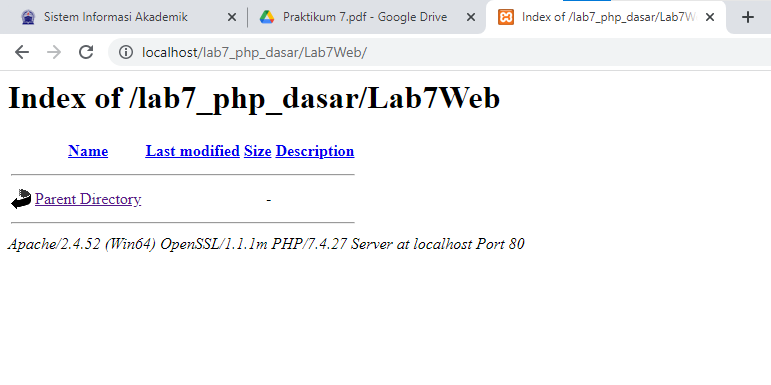

## TUGAS PEMOGRAMAN

| Nama    | Agus sanjaya  |
| ------  | ------------- |
| NIM     | 312010060     |
| Kelas   | TI.20.A1      |
| Matkul  | Pemograman Web|

## Langkah-langkah Praktikum 
# Persiapan  
Untuk memulai membuat kode php, perlu disiapkan web server dan interpreter PHP
terlebih dahulu. Web servar yang kita gunakan adalah Apache 2 dan interpreter PHP 7.
Untuk memudahkan proses praktikum, kita gunakan aplikasi bundle web server yaitu
XAMPP. 
# Install XAMPP  
Unduh XAMPP dari https://www.apachefriends.org/download.html dan pilih versi
portable untuk memudahkan proses installasi. Kemudian extract file tersebut, seusikan
direktorinya (misal: d:\xampp).  
 
# Konfigurasi Web Server  
• Konfigurasi Apache
Untuk konfigurasi HTTP server, seperti port yang digunakan akses HTTP, modul
yang diaktifkan, lokasi document root, dll.
Lokasi file: \xampp\apache\conf\httpd.conf
• Konfigrasi PHP
Untuk konfigurasi perilaku engine PHP yang berefek pada keamanan dan performa.
Seperti batas maksimal waktu eksekusi script, batas file yang dapat diupload, error
reporting, dll.
Lokasi file: \xampp\php\php.ini
• Konfigrasi MySql
Konfigurasi server MySQL, seperti administrator user, port, timezone, dll.
Lokasi file: \xampp\mysql\bin\my.ini  
# Menjalankan Web Server  
Untuk menjalankan web server dari menu XAMPP Control. 
  
• Uji coba apakah server sudah berkerja dengan baik
http://127.0.0.1 atau http://localhost
Tampil halaman utama XAMPP jika server sudah berkerja dengan baik.
• Dokumen Website
Semua file website tempatkan di direktori: \xampp\htdocs\
• Database MySQL
Direktori: \xampp\mysql\
Manajemen database: http://localhost/phpmyadmin  
# Memulai PHP  
Buat folder lab7_php_dasar pada root directory web server (d:\xampp\htdocs)  
  
Kemudian untuk mengakses direktory tersebut pada web server dengan mengakses URL:  
  
# PHP Dasar  
Buat file baru dengan nama php_dasar.php pada directory tersebut. Kemudian buat
kode seperti berikut.  
  
Kemudian untuk mengakses hasilnya melalui URL:
http://localhost/LAB7_PHP_DASAR/php_dasar.php  
  
# Variable PHP 
Menambahkan variable pada program.  
 
dan ini hasilnya.  
  
# Predefine Variable $_GET   